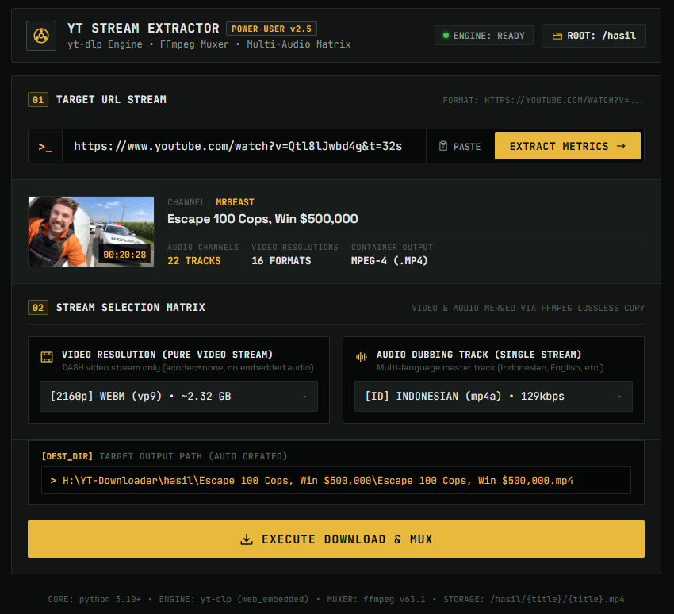
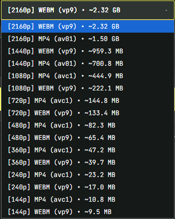
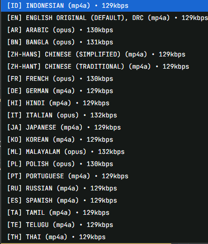

# YouTube Multi-Audio Downloader & Stream Muxer

<p align="center">
  
  
  
  
  
  <a href="https://saweria.co/adewanggar"></a>
  
</p>

Aplikasi desktop/web-based untuk mengunduh video YouTube dengan fitur **pemilihan multi-audio track & dubbing bahasa** secara independen, resolusi video murni hingga **4K/8K 60FPS**, serta penggabungan lossless otomatis menggunakan **FFmpeg**. Dilengkapi antarmuka Cyber-Terminal dengan telemetri progres real-time via Server-Sent Events (SSE).

---

## Screenshot Aplikasi



| Pemilihan Resolusi Video | Pemilihan Audio Track / Dubbing |
| :--- | :--- |
|  |  |

---

## Fitur Utama

- **Mode Switcher (Video MP4 / Audio Only MP3)**: Beralih cepat dengan satu klik antara mode unduh video resolusi tinggi (MP4) atau ekstraksi audio murni berkecepatan tinggi ke format MP3 320 kbps High Quality dengan penyematan metadata otomatis.
- **Multi-Audio Track & Dubbing Picker**: Mendeteksi seluruh track audio yang tersedia (Bahasa Indonesia, English, Spanish, Japanese, Dubbing Auto YouTube, dan Original). Pengguna dapat memilih track audio spesifik yang ingin digabungkan ke video atau dikonversi ke MP3.
- **Pemilihan Resolusi Murni (Video-Only Stream)**: Mendukung seluruh spektrum resolusi YouTube (4K 2160p, 1440p, 1080p60 HDR, 720p, dsb.) langsung dari stream DASH asli.
- **Lossless FFmpeg Muxing & Converting**: Menggabungkan stream video murni dan track audio pilihan tanpa penurunan kualitas (`-c:v copy -c:a aac` untuk MP4, atau ekstraksi audio bitrate tinggi 320 kbps untuk MP3).
- **Real-Time Live Telemetry (SSE)**: Memantau progres unduhan secara live dengan indikator persentase, kecepatan transfer (MB/s), estimasi waktu (ETA), dan tahapan pipeline (Probing -> Video/Audio -> FFmpeg Muxing/Encoding -> Finalizing).
- **Manajemen File Otomatis**: Setiap video otomatis dibuatkan folder khusus di direktori `/hasil/[Judul Video]/[Judul Video].[mp4/mp3]` dengan sanitasi karakter ilegal Windows/Linux.
- **Integrasi Native File Explorer**: Akses satu klik untuk langsung membuka lokasi file dan menyorot (highlight) video di Windows File Explorer.
- **Anti-Bot & JS Challenge Solver**: Dikonfigurasi dengan client `web_embedded` dan `android` extractor serta dukungan runtime Node.js untuk meminimalkan pembatasan akses.
- **Antarmuka Cyber-Terminal**: Tampilan dashboard bertema gelap, tipografi JetBrains Mono dan Space Grotesk, visualisasi status, dan tata letak responsif.

---

## Arsitektur Sistem

```
┌─────────────────────────────────────────────────────────────┐
│                    Frontend (Web Browser)                   │
│   HTML5 • Modern Glassmorphism CSS • Vanilla JavaScript     │
│   (Real-time Telemetry via SSE + Dual Stream Selector)      │
└──────────────────────────────┬──────────────────────────────┘
                               │
            HTTP REST API & Server-Sent Events (SSE)
                               │
┌──────────────────────────────▼──────────────────────────────┐
│                    Backend Server (Flask)                   │
│               Python 3.9+ • Async Worker Thread             │
└──────────────┬──────────────────────────────┬───────────────┘
               │                              │
               ▼                              ▼
    ┌────────────────────┐         ┌────────────────────┐
    │  yt-dlp Extractor  │         │    FFmpeg Core     │
    │  - Stream Parsing  │ ──────▶ │ - Lossless Muxing  │
    │  - Multi-Audio Map │         │ - MP4 Finalizer    │
    └────────────────────┘         └──────────┬─────────┘
                                              │
                                              ▼
                                   ┌────────────────────┐
                                   │   /hasil/ (Disk)   │
                                   │ [Judul]/[File].mp4 │
                                   └────────────────────┘
```

---

## Prasyarat Sistem

Pastikan perangkat Anda telah terpasang:

1. **Python 3.9 atau lebih baru** — [Unduh Python](https://www.python.org/downloads/) *(Centang opsi "Add Python to PATH" saat instalasi di Windows)*.
2. **FFmpeg** *(Wajib untuk proses penggabungan video dan audio)*:
   - **Windows**: Jalankan terminal CMD/PowerShell:
     ```bash
     winget install ffmpeg
     ```
     *Atau unduh dari [ffmpeg.org](https://ffmpeg.org/download.html) lalu daftarkan folder `bin` ke System Environment Variables (PATH).*
   - **macOS** (Homebrew):
     ```bash
     brew install ffmpeg
     ```
   - **Linux** (Debian/Ubuntu):
     ```bash
     sudo apt update && sudo apt install ffmpeg -y
     ```
3. **Node.js** *(Opsional, disarankan untuk solver signature YouTube)* — [Unduh Node.js](https://nodejs.org/).

Verifikasi instalasi di terminal:
```bash
python --version
ffmpeg -version
```

---

## Panduan Instalasi & Menjalankan

### Metode 1: Menggunakan Launcher (Khusus Windows)
Klik dua kali file **`start.bat`** di direktori utama. Script akan otomatis memeriksa dependensi, memasang library yang belum terpasang, dan menjalankan server Flask.

---

### Metode 2: Menjalankan Secara Manual (Semua OS)

1. **Clone repositori ini:**
   ```bash
   git clone https://github.com/adewanggar/yt-downloader.git
   cd yt-downloader
   ```

2. **Buat dan aktifkan Virtual Environment (Disarankan):**
   ```bash
   # Windows
   python -m venv venv
   .\venv\Scripts\activate

   # Linux / macOS
   python3 -m venv venv
   source venv/bin/activate
   ```

3. **Pasang dependensi Python:**
   ```bash
   cd backend
   pip install -r requirements.txt
   ```

4. **Jalankan server aplikasi:**
   ```bash
   python app.py
   ```

5. **Buka aplikasi di browser:**
   Akses URL [http://localhost:5000](http://localhost:5000).

---

## Panduan Penggunaan

1. **Salin URL** video YouTube atau YouTube Shorts yang ingin diunduh.
2. **Tempel URL** ke kolom input terminal, lalu klik tombol **`EXTRACT METRICS`**.
3. Sistem akan menganalisis metadata dan menampilkan daftar:
   - **Video Resolution**: Pilih resolusi video yang diinginkan (contoh: 1080p60, 4K 2160p, 720p).
   - **Audio Dubbing Track**: Pilih track bahasa audio yang diinginkan (contoh: Indonesian, English - original, Spanish).
4. Klik tombol **`EXECUTE DOWNLOAD & MUX`**.
5. Amati live telemetri status, persentase download, kecepatan, dan proses muxing FFmpeg.
6. Setelah selesai, klik **`BUKA FILE DI EXPLORER`** untuk langsung melihat file hasil unduhan di folder penyimpanan lokal.

---

## Struktur Direktori

```text
YT-Downloader/
├── backend/
│   ├── app.py                # Server Flask, REST API, & SSE Stream Handler
│   ├── downloader.py         # Engine yt-dlp, logic parsing audio, & FFmpeg integration
│   ├── requirements.txt      # Daftar dependensi Python
│   └── downloads/            # Direktori temporary buffer
├── frontend/
│   ├── index.html            # Antarmuka Cyber-Terminal Dashboard
│   ├── style.css             # Tema dark glassmorphism & animasi
│   └── script.js             # Logic telemetri SSE, API consumer, & UI state
├── docs/
│   └── screenshots/          # Folder penyimpanan gambar pratinjau aplikasi
│       ├── 1.png             # Screenshot tampilan dashboard utama
│       ├── format_video.png  # Screenshot pemilihan format resolusi video & codec
│       └── audio_track.png   # Screenshot pemilihan track audio & dubbing
├── hasil/                    # Direktori penyimpanan utama (otomatis dibuat)
│   └── [Judul Video]/        # Folder per video
│       └── [Judul Video].mp4 # File MP4 final hasil muxing
├── start.bat                 # Script launcher otomatis untuk Windows
├── YT-Downloader-Guide.md    # Panduan komprehensif teknis
└── README.md                 # Dokumentasi proyek
```

---

## Dokumentasi REST API

Backend menyediakan endpoint API berbasis JSON dan SSE:

| Method | Endpoint | Deskripsi |
|---|---|---|
| `GET` | `/api/health` | Status kesehatan API dan direktori penyimpanan aktif |
| `POST` | `/api/formats` | Mengekstrak metadata video, daftar resolusi, dan semua track audio |
| `POST` | `/api/download` | Memulai background job download dan muxing (mengembalikan `job_id`) |
| `GET` | `/api/progress-stream/<job_id>` | Server-Sent Events (SSE) stream untuk telemetri real-time |
| `GET` | `/api/progress/<job_id>` | Endpoint polling status progres (fallback) |
| `POST` | `/api/open-folder` | Membuka folder output langsung di File Explorer OS |
| `GET` | `/api/stream-file?path=...` | Mengunduh file langsung melalui stream browser |

### Contoh Request `/api/download`:

**1. Mode Video (MP4):**
```json
POST /api/download
Content-Type: application/json

{
  "url": "https://www.youtube.com/watch?v=dQw4w9WgXcQ",
  "mode": "video",
  "video_format_id": "137",
  "audio_format_id": "251"
}
```

**2. Mode Audio Only (MP3 320kbps):**
```json
POST /api/download
Content-Type: application/json

{
  "url": "https://www.youtube.com/watch?v=dQw4w9WgXcQ",
  "mode": "mp3",
  "audio_format_id": "251"
}
```

---

## Troubleshooting & FAQ

### 1. Error: "FFmpeg not found" / Video dan Audio tidak tergabung
Pastikan FFmpeg sudah terinstal dan perintah `ffmpeg -version` dapat dijalankan dari Command Prompt atau Terminal. Jika baru saja menginstal FFmpeg, restart terminal atau restart komputer agar environment variable PATH diperbarui.

### 2. Pilihan audio dubbing tidak muncul pada beberapa video
Pilihan multi-audio hanya akan tersedia jika kreator video mengunggah multi-language track atau jika YouTube telah mengaktifkan fitur Auto-Dubbing pada video tersebut. Jika video hanya memiliki satu audio standar, sistem akan otomatis memilih audio default terbaik.

### 3. Muncul peringatan "Sign in to confirm you're not a bot"
YouTube secara berkala memperbarui proteksi bot. Pastikan library `yt-dlp` selalu diperbarui ke versi terbaru:
```bash
pip install --upgrade yt-dlp
```
Pastikan juga Node.js terinstal di sistem untuk membantu eksekusi challenge token YouTube.

---

## Ketentuan Penggunaan

Alat ini dikembangkan untuk tujuan edukasi, riset teknologi stream muxing, dan arsip konten pribadi. Pengguna bertanggung jawab penuh atas penggunaan alat ini. Patuhi Terms of Service YouTube serta undang-undang hak cipta yang berlaku di wilayah hukum Anda.

---

## Penulis & Dukungan

- **adewanggar** — [GitHub Profile](https://github.com/adewanggar)

Jika aplikasi ini bermanfaat untuk Anda, Anda dapat mendukung pengembangan proyek ini melalui:
- **Saweria**: [https://saweria.co/adewanggar](https://saweria.co/adewanggar)

---

## Lisensi

Didistribusikan di bawah Lisensi MIT. Lihat file `LICENSE` untuk informasi lebih lanjut.

